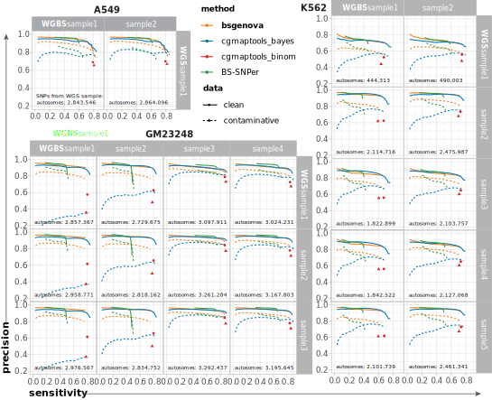
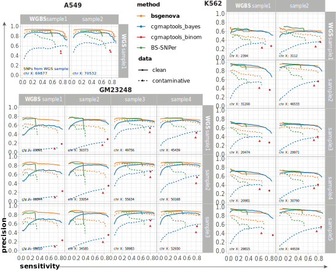

# bsgenova

 = *bs-geno-nova* = *bs-genova*

An **accurate**, **robust**, and **fast** genotype caller for **bisulfite-converted** sequencing data for both single-cell and bulk samples, such (sc)WGBS, (sc)RRBS.

- bsgenova is precise and sensitive
- bsgenova is resistant against contaminative/low-quality data
- bsgenova is fast, consuming ~3 hours with 4 CPU cores for deep WGBS sample
- bsgenova is memory- and disk-efficient
- use bsextractor to extract methylalation/whole-genome coverage from bam file

## Examples

- call SNPs from ATCGmap file (with example data)  
`python ./bsgenova.py -i data/example.atcg.gz -o output/example`

- call SNPs from bam file  
`python ./bsextractor.py -b /path/to/sample.bam -g /path/to/genome.fa --output-atcgmap - | python ./bsgenova.py -o output/sample`

- extrct ATCGmap, CGmap, and bed files from bam file  
`python ./bsextractor.py -b /path/to/sample.bam -g /path/to/genome.fa --output-atcgmap sample.ATCGmap.gz --output-cgmap sample.CGmap.gz --output-bed sample.bed.gz`

- extrct ATCGmap file for a subset of genome  
`python ./bsextractor.py -b /path/to/sample.bam -g /path/to/genome.fa --output-atcgmap sample.ATCGmap.gz --chr chr1,chr22 --start 1000000 --end 1100000`

## Installation and dependencies

- python >= 3.8
- numpy >= 1.13
- pysam >= 1.18 (only for ***bsextractor***)

You can use `pip` or `conda` or else to install `numpy` and `pysam`.

## Performance

### For autosomes



### For chromosome X



## Resource usage


## Parameters

|**parameter** | **type** | **description**| **defaults** |
|  ----  | ----  | ----  | ----  |
| `-i`, `--atcg-file` | `string` | an input `.ATCGmap[.gz]` file| read from `stdin` |
| `-o`, `--output-prefix` | `string` | prefix of output files, for input `path/sample.ATCGmap.gz`, the deault output is `path/sample.snv.gz` and `path/sample.vcf.gz`, equivalant to set `-o path/sample` | prefix of output files; bsgenova will not create directoy automatically |
|`--sample-name`|`string`|the sample name used in vcf file. | use the basename of output specified by `--output-prefix` or derived from input ATCGmap file name|
|`-m`, `--mutation-rate`| `float` | mutation rate that a haploid base is different with reference base |0.001 |
|`-e`, `--error-rate` | `float` |error rate a base is misdetected due to sequencing or mapping | 0.03|
|`-c`, `--methy-cg` |`float` | Cytosine methylation rate of CpG-context | 0.6|
|`-n`, `--methy-ch` |`float` |Cytosine methylation rate of non-CpG-context | 0.01|
|`-d`, `--min-depth` |`float` | sites with coverage depth less than minimal depth will be skipped | 10|
|`-p`, `--pvalue` |`float` | *p*-value threshold (the *p*-value is actually posterior probability) |0.01|
|`--shrink-depth` |`integer` | sites with coverage larger than this value will be shrinked by a square-root transform | 60|
|`--batch-size` |`integer` | a batch of genomic sites will be processed at the same time |10000|
|`-P`, `--num-process` |`integer` | number of processes in parallel |4|
|`--pool-lower-num` |`integer` | lower number of bacthes in memory pool per process |10|
|`--pool-upper-num` |`integer` | upper number of bacthes in memory pool per process |30|
|`--keep-order` |`logical` | keep the results same order with input, if the order of sites makes no difference, set `False` to enable faster non-blocking asynchronous IO, True/False or Yes/No, case insensitive | True|
|`-h`, `--help` | | show this help message and exit ||

## Parameter selection

- `-m`, `--mutation-rate`, mutation rate that a haploid base is different with reference base. The genome-wide mutation rate of normal organism is about 0.001. For samples with abnormal genome, it can be set larger.
- `-e`, `--error-rate`, error rate a base is mis-detected due to sequencing or mapping. The error rate for bisulfite sequencing samples is usually 1% ~ 5%. If the data is of lower quality for some reasons, set it larger to avoid false positives.
- `-c`, `--methy-cg` and `-n`, `--methy-ch`, Cytosine methylation rates of CpG-context and non-CpG-context cytosines, respectively. The cytosines methylation levels are the **observed values from sequencing samples without any correction**, such as incomplete and over conversion. For mammal genomes of body cells, it is usually 60% ~ 80% and 1% ~ 5%, respectively. For sperms, the genome is hyper-methylated; for oocytes, the genome is hypo-methylated; for embryos and plants, there are significant methylation of non-CpG cytosines.
- `-d`, `--min-depth`, sites with coverage depth less than minimal depth will be skipped. 10 conventionally. For samples with less sequencing depth, it can be set lower say 6.
- `-p`, `--pvalue`, *p*-value threshold (the *p*-value is actually posterior probability). For samples sequenced deeply, it can be set smaller, say 0.001 or smaller, otherwise, set it larger, say 0.01, 0.05, by default 0.01.

## Input

an `ATCGmap` file, extracted by `bsextractor`, `bsseeker2/3` or `cgmaptools` from alignment `bam` file

|**column** | description|
|  ----  | ----  |
|1-3| chromosome, reference base, position|
|4-5| CpG context, two-nucleotide context|
|6-10| read counts of ATCGN mapped on Watson strand|
|11-15| read counts of ATCGN mapped on Crick strand|
|16| methylation level |

The columns 5, 10, 15, and 16 are not used in bsgenova thus can be arbitrarily filled.

an example

```
chr1	C	10467	CG	CG	0	1	0	0	0	1	0	68	0	0	0.00
chr1	G	10468	CG	CG	0	1	0	0	0	0	33	0	0	0	nan
chr1	C	10469	CG	CG	0	0	0	1	0	0	0	18	0	0	nan	
chr1	G	10470	CG	CG	0	0	0	1	0	18	0	0	8	0	0.31
chr1	G	10471	CHG	CC	0	0	1	0	0	0	0	38	0	0	nan
chr1	T	10472	--	--	0	0	0	1	0	1	0	2	8	0	nan
```

## Output

The .snv file is equivalent to .vcf file.

### .snv file

|**column** | description|
|  ----  | ----  |
|1| chromosome|
|2| position|
|3| reference base|
|4| posterior probability of not a SNV (different from reference)|
|5| max posterior probability|
|6-7| posterior probability of a homozygote/heterzygote  |
|8-11| posterior allele frequencies of A,T,C, and G, respectively |
|12-13| coverage depths of Watson and Crick strands, respectively|

an example

```
1	1023917	G	4.56e-27	1.00e+00	9.98e-14	1.00e+00	1.88e-20	6.71e-09	5.00e-01	5.00e-01	20	13
1	1023921	C	3.26e-53	9.97e-01	9.97e-01	2.64e-03	1.32e-03	9.31e-09	7.28e-07	9.99e-01	20	13
1	1024083	A	1.43e-16	8.29e-01	8.29e-01	1.71e-01	8.56e-02	3.86e-06	3.86e-06	9.14e-01	10	8
1	1024085	C	2.30e-09	1.00e+00	1.00e-04	1.00e+00	4.59e-10	5.00e-01	5.00e-01	4.59e-10	12	8
1	1024093	C	1.79e-18	1.00e+00	1.26e-10	1.00e+00	5.00e-01	1.99e-06	5.00e-01	4.72e-14	13	8
1	1024131	C	8.62e-06	9.25e-01	7.54e-02	9.25e-01	8.84e-08	5.38e-01	4.62e-01	8.84e-08	15	4
```

### .vcf file

Standard .vcf file.

an example

```
##fileformat=VCFv4.4
##fileDate=20240901-07:30:08
##source=bsgenova (version 1.0.0): ./bsgenova.py -i ./data/example.ATCGmap.gz -o output/example --sample-name s1
##INFO=<ID=NS,Number=1,Type=Integer,Description="Number of Samples with Data">
##INFO=<ID=DP,Number=1,Type=Integer,Description="Total Read Depth">
##INFO=<ID=DPW,Number=1,Type=Integer,Description="Read Depth of Watson Strand">
##INFO=<ID=DPC,Number=1,Type=Integer,Description="Read Depth of Crick Strand">
##INFO=<ID=AF,Number=A,Type=Float,Description="Allele Frequency">
##FILTER=<ID=q30,Description="Quality<30">
##FORMAT=<ID=GT,Number=1,Type=String,Description="Genotype">
##FORMAT=<ID=GQ,Number=1,Type=Integer,Description="Genotype Quality. the Phred score -10*log10 (1 -  max posterior probability). If you do not want ambiguous results, filter sites with low GQ values.">
##FORMAT=<ID=GQH,Number=1,Type=Integer,Description="Genotype Quality of homozygote/heterozygote.In some cases of single-stranded coverge, we are sure there is a SNV, but we can not determine the genotype. So, we express the GQH as the Phred score -10*log10 (1 - posterior probability of homozygote/heterozygote), to indicate the quality of homozygote/heterozygote. This is somewhat different with SNV calling from WGS data.">
##FORMAT=<ID=DP,Number=1,Type=Integer,Description="Total Read Depth">
##FORMAT=<ID=DPW,Number=1,Type=Integer,Description="Read Depth of Watson Strand">
##FORMAT=<ID=DPC,Number=1,Type=Integer,Description="Read Depth of Crick Strand">
#CHROM	POS	ID	REF	ALT	QUAL	FILTER	INFO	FORMAT	s1
1	1023917	.	G	C	263	PASS	NS=1;DP=33;DPW=20;DPC=13;AF=0.500	GT:GQ:GQH:DP:DPW:DPC	0/1:79:263:33:20:13
1	1023921	.	C	G	525	PASS	NS=1;DP=33;DPW=20;DPC=13;AF=0.999	GT:GQ:GQH:DP:DPW:DPC	1/1:26:525:33:20:13
1	1024083	.	A	G	158	PASS	NS=1;DP=18;DPW=10;DPC=8;AF=0.914	GT:GQ:GQH:DP:DPW:DPC	1/1:8:158:18:10:8
1	1024085	.	C	T	86	PASS	NS=1;DP=20;DPW=12;DPC=8;AF=0.500	GT:GQ:GQH:DP:DPW:DPC	0/1:40:86:20:12:8
1	1024093	.	C	A	177	PASS	NS=1;DP=21;DPW=13;DPC=8;AF=0.500	GT:GQ:GQH:DP:DPW:DPC	0/1:54:177:21:13:8
1	1024131	.	C	T	51	PASS	NS=1;DP=19;DPW=15;DPC=4;AF=0.538	GT:GQ:GQH:DP:DPW:DPC	0/1:11:51:19:15:4
```

# bsextractor

## Parameters

|**parameter** | **type** | **description**| **defaults** |
|  ----  | ----  | ----  | ----  |
|`-b/--bam-file`|`string`|an input .bam file|required|
|`-g/--reference-genome`|`string`|genome reference .fa file with index (.fai) in the same path|required|
|`--output-atcgmap`|`string`|output of ATCGmap file, `-`for `stdout`||
|`--output-cgmap`|`string`|output of CGmap file, `-`for `stdout`|||
|`--output-bed`|`string`|output of bedgraph file, `-`for `stdout`||
|`--chr`|`string`|chromosomes/contigs, use `,` to seperate, ie `chr1,chr2`|all|
|`--start`|`integer`|start coordinate of chromosomes/contigs|0|
|`--end`|`integer`|end coordinate of chromosomes/contigs|math.inf|
|`--batch-size`|`integer`|batch size of genomic intervals|2_000_000|
|`--swap-strand`|`logical`|swap read counts on two strands, true/false, or yes/no|no|
|`--base-quality`|`integer`|base sequencing quality threshold|0|
|`--read-quality`|`integer`|read mapping quality threshold|0|
|`--coordinate-base`|`integer`|0/1-based coordinate of output|1|

## Outputs

Each of the following is optional

- `ATCGmap` file, containing coverage information of all genomic sites
- `CGmap` file, containing coverage information of C/G
- `bedgraph` file, containing methylation levels of CG-context sites

# Citation

Feng Y, Gao F. **bsgenova: an accurate, robust, and fast genotype caller for bisulfite-sequencing data.** *BMC Bioinformatics*. 2024;25(1):206. Published 2024 Jun 5. doi:10.1186/s12859-024-05821-7

